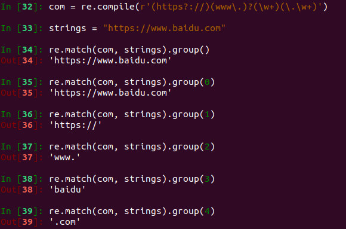
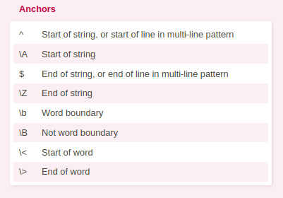
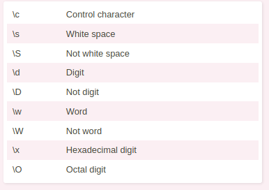
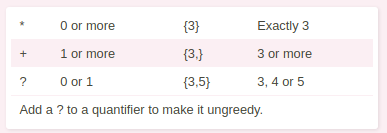
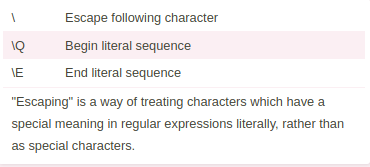
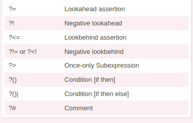
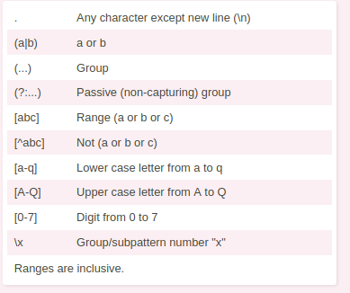
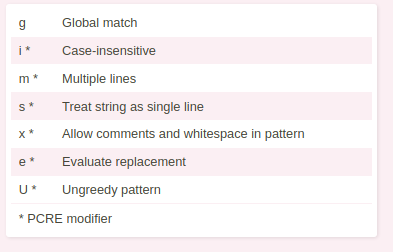
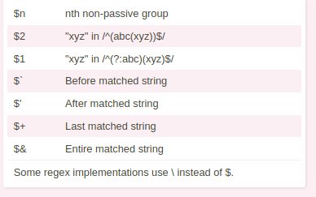

# Regex selector

[TOC]

## Note: raw input for different language 

```python
# python
>>> print(r"\n")
\n
>>> print("\n")


```



```c++
// C++
 1 #include <iostream>
 2 #include <string>
 3 
 4 using namespace std;
 5 
 6 int main()
 7 {
 8     string normal_str="First line.\nSecond line.\nEnd of message.\n";
 9     string raw_str=R"(First line.\nSecond line.\nEnd of message.\n)";
10     cout<<normal_str<<endl;
11     cout<<raw_str<<endl;
12     return(0);
13 }
```

## Potential tutorial

https://www.youtube.com/watch?v=sa-TUpSx1JA


## CheatSheet

Anchors



1. word boundary 
   1. have boundary for the word (like whitespace, tab, newline, first word)

Character Classes 



Quantifier 



Escaping character 



Assertion



Groups and ranges




Pattern Modifier 




String replacement 



