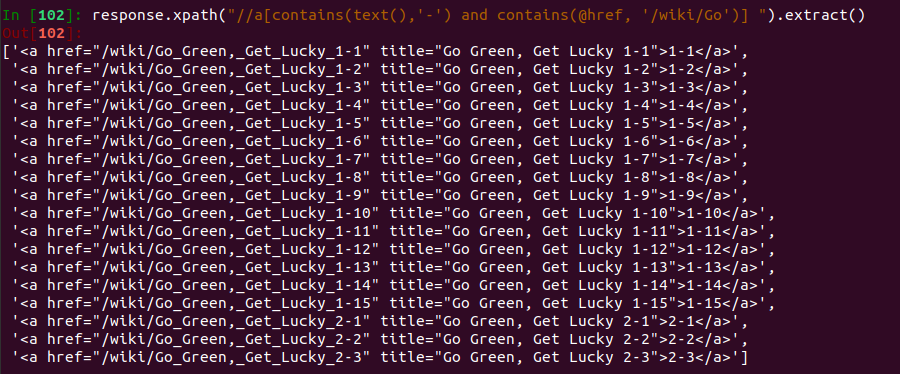

# Xpath selector to parse HTML

[TOC]

## Search Grammar

### Search by notes structure

```
/node1/node2[1] #node1的子节点中的第1个node2
/node1/node2[last()] #node1的子节点中的最后一个node2
/node1/node2[last()-1] #倒数第二个node2
/node1/node2[position()<3] #node2子节点的前2个
/node1/node2 | node1/node3 #取2个路径下的并集
```

### Search by attributes 

```
//node[@attribute] #包含attribute属性的节点node
//node[@attribute="value"]#包含attribute且值为value的节点node
//node[@attribute1="value1" and/or @attribute2="value2"] #2个属性结合使用，and是取交集，两个属性同时满足；or并集，满足一个即可；
//node[contains(@attribute,"***")] #包含属性值的部分内容
//node[starts-with(@attribute,"***")] #属性值以***开头的标签
```

### Search by Keywords

#### by contain

```python
例：//div[@class="XXX" and contains(@style,"display:visibility")]

语法1：//tag[contains(@attribute,‘value’)]

语法2：//tag[contains(text(),‘value’)]

示例1：//a[contains(@class,‘abc123’)
                                           
示例2：//tag[contains(text(),‘Enroll now’)]
```

#### by text() and . (dot)

```
语法：tag[text()='value'] 其中tag是要定位到的 text 的标签
示例：//div[@class='homepage-hero']//a[text()='Enroll now']

# text is also the child of a tag
//a/text()

# Difference between text and .

<a>Ask Question<other/>more text</a>
//a[text()="Ask Question"] # text() detect text nodes 
//a[text()="more text"]
//a[.='Ask Questionmore text'] # . detect all the string literals 
```

#### by starts-with

```
语法：//tag[starts-with(@attribute,'value')]

示例：//a[starts-with(@class,'abc123')] 搜索以“abc123”开头的class
```

### Jump using current node 

```
//button[contains(.,'Arcade Reader')]/preceding-sibling::button[@name='settings']

parent::
ancestor::
preceding-sibling::
ancestor-or-self::input
descendant::
Following-sibling::
```

### String() vs //text()

we found out that something string() function is more suitable and semantically correct when we want to receive the string content inside the current node 

```python
In [122]: response.xpath("//h2/span[contains(@id , 'Walkthrough') or contains(@id, 'Strategy')]/../following-sibling::p[preceding-sibling::
     ...: h2[1]/span[contains(@id , 'Walkthrough') or contains(@id, 'Strategy')]]").xpath(".//text()").extract()
Out[122]: 
['Bomb',
 ' should aim himself at the middle of the "pyramid" between the two dice. He should rest directly on the wood vertical plank before detonation. The first ',
 'Matilda',
 ' should aim herself at the remaining ',
 'Small Pig',
 ', releasing the ',
 'Egg Bomb',
 ' just before impact. The final unused Matilda will reward the player 10,000 extra points.\n',
 'See ',
 'Poached Eggs 3-15/Video Walkthrough',
 '\n',
 '\n']

In [123]: response.xpath("//h2/span[contains(@id , 'Walkthrough') or contains(@id, 'Strategy')]/../following-sibling::p[preceding-sibling::
     ...: h2[1]/span[contains(@id , 'Walkthrough') or contains(@id, 'Strategy')]]").xpath("string(.)").extract()
Out[123]: 
['Bomb should aim himself at the middle of the "pyramid" between the two dice. He should rest directly on the wood vertical plank before detonation. The first Matilda should aim herself at the remaining Small Pig, releasing the Egg Bomb just before impact. The final unused Matilda will reward the player 10,000 extra points.\n',
 'See Poached Eggs 3-15/Video Walkthrough\n',
 '\n']

```

### Conditional expression

```python
# boolean expression should better add parenthesis, especially "and not"

response.xpath("//h2/span[contains(@id , 'Walkthrough') or contains(@id, 'Strategy')]/../following-sibling::p[preceding-sibling::h2[1]/span[(contains(@id , 'Walkthrough') or contains(@id, 'Strategy')) and not(contains(@id, 'Video'))]]").xpath("string()").extract()


data1 = selector.xpath("//input[@type='submit' and @name='f']");
data2 = selector.xpath("//input[@type='submit' or @name='f']");
data2 = selector.xpath("//input[@type='submit' and not(contains(@name,'f'))]");
data3 = selector.xpath("//input[starts-with(@id,'f')]"));
data4 = selector.xpath("//input[ends-with(@id,'f')]"));
data5 = selector.xpath("//input[contains(@id,'f')]"));

# condition: has child node x 
xpath("//input[x]")  # not /x but x
```

### Order for preceding-sibling 

preceding-sibling::node()[1] is the nearest sibling node from the current node

### Issue about nested text and other tags 

```html
<a href="javascript:void(0)" title="home">
    <span class="menu_icon">Maybe more text here</span>
    Home
</a>

```

```
//a[contains(text(), 'Home')] # will not work 

# it says to select all a elements whose first text node contains the substring Home. Yet, the first text node contains nothing but whitespace.

# correct answer 
//a[text()[contains(., 'Home')]]
# which says to select all a elements with any text child whose string value contains the substring Home.
```

### Use of and condition 



Notice that for and condition the first argument of the contains function can only be @attribute or text() 

text() in the contain function is already refers to the embedded texts (i.e. /text())

(//text() is not allowed) 

### extract and extract_first

extract gives array while extract_first gives first element that matches 

```python
class TestSpider(scrapy.Spider):
    name = "test"
    start_urls = ["https://www.baidu.com/"]

    def parse(self, response):
        title = response.xpath('//*[@id="su"]/@value').extract_first()
        title_ = response.xpath('//*[@id="su"]/@value').extract()
        self.logger.info(title)
        self.logger.info(title_)
```

```python
2019-06-13 11:23:26 [test] INFO: 百度一下
2019-06-13 11:23:26 [test] INFO: ['百度一下']
```


### side notes

1. any node
   1. //*  # this match any node
   2. @*  this match any attribute