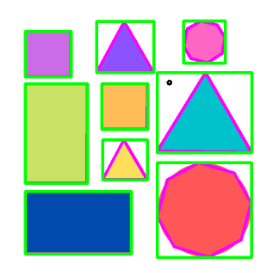

# Get Start OpenCV

[TOC]

## Installation 

```bash
# install opencv optional 
sudo apt install libopencv-dev python3-opencv -y
```


Now this is your first app

```c++
#include "fmt/format.h"
#include "opencv2/imgcodecs.hpp"
#include "opencv2/highgui.hpp"
#include "opencv2/imgproc.hpp"
#include <string>
#include <iostream>
using namespace fmt;
using namespace cv;

int main() {
//    path location, NOTEl: better edit the configuration and set the working directory as current folder
    string_view path = "Resources/test.png";
//    image matrix
    Mat img = imread(path.data());
//    show the image, window name is Image
    imshow("Image", img);
//    add waitKey
    waitKey(0);
    return 0;
}

```


## Setting up Webcam

```c++
#include "fmt/format.h"
#include "opencv2/imgcodecs.hpp"
#include "opencv2/highgui.hpp"
#include "opencv2/imgproc.hpp"
#include <string>
#include <iostream>
using namespace fmt;
using namespace cv;

int main() {

//    you need to check your default camera device
    VideoCapture cap(0);
    Mat img;

//    you want to set the size of the window
    namedWindow("Image", WINDOW_NORMAL);
    resizeWindow("Image", 400, 300);
    
//    somehow when you use while loop, the stdout will buffer the output and
//    therefore, set the buffer to NULL, you can immediately get the print word
    setbuf(stdout, NULL);

    // while loop detect if window is gone
    while (getWindowProperty("Image", WND_PROP_AUTOSIZE) != -1) {
        print("Read img\n");
        cap.read(img);
        imshow("Image", img);
        waitKey(1);
    }
    return 0;
}

```


## GCC flag

### debian experimental server

```
 deb http://httpredir.debian.org/debian/ experimental main contrib non-free

apt-key adv --keyserver   keyserver.ubuntu.com --recv-keys 648ACFD622F3D138
```


```bash
gcc -fmodules-ts -std=c++20 moduletest.cpp -o out

sudo update-alternatives --config gcc
```

### Cpp files sample

```cpp
module;
#include <iostream>
#include <string_view>
export module hello;
export void greeter (std::string_view const &name)
{
  std::cout << "Hello " << name << "!\n";
}

```

```cpp
import hello;
int main (void)
{
  greeter ("world");
  return 0;
}
```

## Chapter 1

```cpp
//
// Created by sukai on 29/1/21.
//

#include "headers.h"

using namespace cv;
//using namespace std;
using namespace fmt;

// webcam
int chapter1(){
    // add CAP_V4L will modify the size of the webcam
    // this will significantly enhance the efficiency
    VideoCapture cap(0, CAP_V4L);


    //declare Mat outside for efficiency
    Mat img;
    // while loop
    while (true) {
        // a matrix
        cap.read(img);
        imshow("Image", img);
        // this control the speed of video
        waitKey(1);
    }
    return 0;
}

// video
int chapter1_video(){
    // video is series of images

    string_view path = "Resources/test_video.mp4";
    VideoCapture cap(path.data());

    //declare Mat outside for efficiency
    Mat img;
    // while loop
    while (true) {
        // a matrix
        cap.read(img);
        imshow("Image", img);
        // this control the speed of video
        waitKey(20);
    }
    return 0;

}

// image
int chapter1_image(){
    string_view path = "Resources/test.png";
    // a matrix
    Mat img = imread(path.data());
    imshow("Image", img);
    // add delay
    waitKey();
    return 0;
}
```

## Chapter 2

```cpp
//
// Created by sukai on 29/1/21.
//

#include "headers.h"

using namespace cv;
using namespace fmt;

// basic functions
int chapter2(){
    string_view path = "Resources/test.png";
    // a matrix
    Mat img = imread(path.data());
    Mat imgGrey;
    Mat imgBlur;
    Mat imgCanny;
    Mat imgDia;
    Mat imgErode;

    // convert to grey scale
    // static void cvtColor(InputArray src, OutputArray dst, int code, int dstCn = 0)
    cvtColor(img, imgGrey, COLOR_RGB2GRAY);


    //image blur effect
    GaussianBlur(img, imgBlur, Size(3, 3), 5, 0);

    //edge detector
    Canny(imgBlur, imgCanny, 50, 150);

    // increase size, dilate more, decrease, dilate less, better use odd number
    Mat kernel = getStructuringElement(MORPH_RECT, Size(3, 3));
    // increase the thickness or other way of the edge image
    dilate(imgCanny, imgDia, kernel);
    erode(imgCanny, imgErode, kernel);

    imshow("Image", img);
    imshow("ImageGrey", imgGrey);
    imshow("ImageBlur", imgBlur);
    imshow("ImageCanny", imgCanny);
    imshow("ImageDia", imgDia);
    imshow("ImageErode", imgErode);
    // add delay
    waitKey();
    return 0;
}
```


## chapter 3

```cpp
//
// Created by sukai on 29/1/21.
//

//
// Created by sukai on 29/1/21.
//

#include "headers.h"

using namespace cv;
using namespace fmt;

// basic functions
int chapter3(){
    string_view path = "Resources/test.png";
    // a matrix
    Mat img = imread(path.data());
    Mat imgResize;
    //image size is 768 and 559
    print("image size is {} and {}", img.size().width, img.size().height);

//    fflush(stdout);

    // scale to fix size
//    resize(img, imgResize, Size(200, 200));
    // scaling
    resize(img, imgResize, Size(), 0.5, 0.5);

    // crop, get region of interests

    Rect roi(100, 100, 300, 250);
    //    roi    Extracted submatrix specified as a rectangle.
    Mat imgCorp = img(roi);

    imshow("Image", img);
    imshow("Resize", imgResize);
    imshow("Crop", imgCorp);

    // add delay
    waitKey();
    return 0;
}
```


## Chapter 4

```cpp
//
// Created by sukai on 29/1/21.
//

//
// Created by sukai on 29/1/21.
//

#include "headers.h"

using namespace cv;
using namespace fmt;

// basic functions
int chapter4(){

    system("pwd");
    //Blank img
    // size, bit_channel,
    Mat img(512, 512, CV_8UC3, Scalar(255, 255, 255));

    //draw stuffs
    // circle
    circle(img, Point(256, 256), 155, Scalar(0, 69, 225),FILLED);
    //rect
    rectangle(img, Point(130, 226), Point(382, 286), Scalar(255, 255, 255), FILLED);
    //line
    line(img, Point(130, 296), Point(382, 296), Scalar(255, 255, 255), 2);
    //text
    putText(img, "THIS IS SUKAI", Point(137, 262), FONT_HERSHEY_COMPLEX, 0.75, Scalar(0, 69, 255), 2);

    imshow("Image", img);

    // add delay
    waitKey();
    return 0;
}
```


## Chapter 5

```cpp
//
// Created by sukai on 29/1/21.
//

//
// Created by sukai on 29/1/21.
//

#include "headers.h"

using namespace cv;
using namespace fmt;

// basic functions
int chapter5(){

    system("pwd");

    float w = 250, h = 350;

    // warp perspective
    string_view path = "Resources/cards.jpg";
    Mat img = imread(path.data());

//    Point2f src[4] = {{529, 142},
//                      {771, 190},
//                      {405, 395},
//                      {674, 457}};

    Point2f src[4] = {{779,107},
                      {1019,83},
                      {845,361},
                      {1119,336}};

    Point2f dst[4] = {{0.0f,0.0f},
                      {w, 0.0f},
                      {0.0f, h},
                      {w, h}};

    // we need a matrix to transform the image
    // perspective transform, transform the viewing perspective matrix
    auto matrix = getPerspectiveTransform(src, dst);
    Mat imgWarp;
    // apply the warp Perspective
    warpPerspective(img, imgWarp, matrix, Point(w, h));

    for (int i = 0; i < 4; ++i) {
        // draw node point
        circle(img, src[i], 10, Scalar(0, 69, 255), FILLED);
    }

    imshow("Image", img);
    imshow("Image Warp", imgWarp);
    // add delay
    waitKey();
    return 0;
}
```

## Chapter 6

```cpp
//
// Created by sukai on 29/1/21.
//

//
// Created by sukai on 29/1/21.
//

#include "headers.h"

using namespace cv;
using namespace fmt;
// Color Detection

// basic functions
int chapter6(){

    system("pwd");

    string_view path = "Resources/lambo.png";
    Mat img = imread(path.data());
    Mat imgHSV;
    Mat outputmask;

    // convert color
    //IMPORTANT, by default OpenCV read BGR not RGB color format
    cvtColor(img, imgHSV, COLOR_BGR2HSV);

    // we select a range of color
    // this might not be the correct value this is hand crafted
    int hmin = 0, smin = 110, vmin = 153;
    int hmax = 19, smax = 240, vmax = 255;


    // thus create trackbar for HSV for the application
    namedWindow("Trackbars", (640, 200));
    createTrackbar("Hue Min", "Trackbars", &hmin, 179);
    createTrackbar("Hue Max", "Trackbars", &hmax, 179);
    createTrackbar("Saturation Min", "Trackbars", &smin, 255);
    createTrackbar("Saturation Max", "Trackbars", &smax, 255);
    createTrackbar("Val Min", "Trackbars", &vmin, 255);
    createTrackbar("Val Max", "Trackbars", &vmax, 255);


    while (true) {
        Scalar lowerr(hmin, smin, vmin);
        Scalar upperr(hmax, smax, vmax);

        inRange(imgHSV, lowerr, upperr, outputmask);


        imshow("Image", img);
        imshow("ImageHSV", imgHSV);
        imshow("ImageMSK", outputmask);

        // add delay
        waitKey(1);

    }

    return 0;
}
```

## Chapter 7

```cpp
//
// Created by sukai on 29/1/21.
//

//
// Created by sukai on 29/1/21.
//

#include "headers.h"


using namespace cv;
using namespace fmt;

// shape detection

auto getContours(Mat imgDil, Mat img) -> void{
    std::vector<std::vector<Point>> contours;

    std::vector<Vec4i> hierarchy;
    // find contours
    findContours(imgDil, contours, hierarchy, RETR_EXTERNAL, CHAIN_APPROX_SIMPLE);
    std::vector<std::vector<Point>> contourPoly(contours.size()); // btw vector push back stuff
    std::vector<Rect> boundRect(contours.size()); //

    // draw contours
//    drawContours(img, contours, -1, Scalar(255, 0, 255), 2);
    //loop all contours and filter some noise if you want
    for (int i = 0; i < contours.size(); ++i) {
        auto area = contourArea(contours[i]);
        print("Area is {}\n", area);
        std::string objectType;
        if (area > 1000) {
            //Calculates a contour perimeter or a curve length.
            float perimeter = arcLength(contours[i], true);
            // this only contains the corner point, episilon is the maxmum distance from the approx corner to the original edge
            approxPolyDP(contours[i], contourPoly[i], 0.02 * perimeter, true);
            drawContours(img, contourPoly, i, Scalar(255, 0, 255), 5);
            boundRect[i]= boundingRect(contourPoly[i]);
            rectangle(img, boundRect[i].tl(), boundRect[i].br(), Scalar(0, 255, 0), 5);
            int objCor = (int) contourPoly[i].size();
            if (objCor == 3) {
                objectType = "Tri";
            }
            if (objCor == 4) {
                // check height width ratio and determine square or rectangle
                float aspRatio =  boundRect[i].width / (float) boundRect[i].height; //at least change one type to float
                print("aspRatio is {}\n", aspRatio);
                if (aspRatio > 0.95 && aspRatio < 1.05) {
                    objectType = "Square";
                } else {
                    objectType = "Rect";
                }
            }
            if (objCor >= 5) {
                objectType = "Circle";
            }
            // put the text on the image
            putText(img, objectType.data(), {boundRect[i].x, boundRect[i].y - 5}, FONT_HERSHEY_PLAIN, 0.75,
                    Scalar(0, 69, 255), 1);
        }
    }
}

int chapter7(){
    Mat imgGray, imgBlur, imgCanny, imgDil;

    system("pwd");
    string_view path = "Resources/shapes.png";
    // a matrix
    Mat img = imread(path.data());
    cvtColor(img, imgGray, COLOR_BGR2GRAY);

    GaussianBlur(imgGray, imgBlur, Size(3, 3), 3, 0);
    Canny(imgBlur, imgCanny, 25, 75);

    //dilate
    // shape detection works better using dilate image
    Mat kernel = getStructuringElement(MORPH_RECT, Size(3, 3));
    dilate(imgCanny, imgDil, kernel);

    getContours(imgDil, img);

    imshow("Image", img);
//    imshow("Image Gray", imgGray);
//    imshow("Image Blur", imgBlur);
//    imshow("Image Canny", imgCanny);
//    imshow("Image Dia", imgDil);
    // add delay
    waitKey(0);
    return 0;
}
```



## Chapter 8

```cpp
//
// Created by sukai on 29/1/21.
//

#include "headers.h"
#include "opencv2/objdetect.hpp"

using namespace cv;
//using namespace std;
using namespace fmt;

//detect face

int chapter8(){
    string_view path = "Resources/test.png";
    // a matrix
    Mat img = imread(path.data());

    CascadeClassifier faceCascade;
    faceCascade.load("Resources/haarcascade_frontalface_default.xml");

    if (faceCascade.empty()) {
        print("XML file not loaded\n");
    }

    std::vector<Rect> faces;
    faceCascade.detectMultiScale(img, faces, 1.1, 10);
    for (int i = 0; i < faces.size(); ++i) {
        rectangle(img, faces[i].tl(), faces[i].br(), Scalar(255, 0, 255), 3);

    }

    imshow("Image", img);
    // add delay
    waitKey();
    return 0;
}
```

